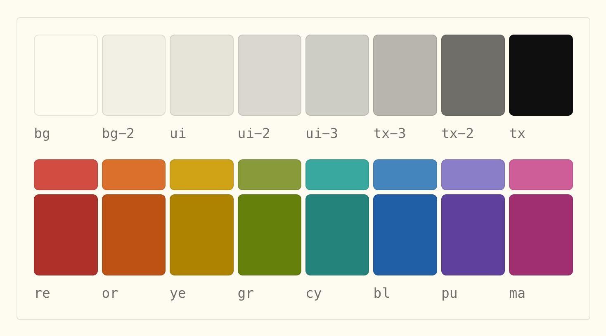

# Flexoki

[Article](https://stephango.com/flexoki) by Steph Ango on a paper-styled color system for interfaces. I like how the chroma is muted convincingly if we compare it to printing. Are they mixed with the background? I would like to integrate this into the [[paper-like_web]] concept.

