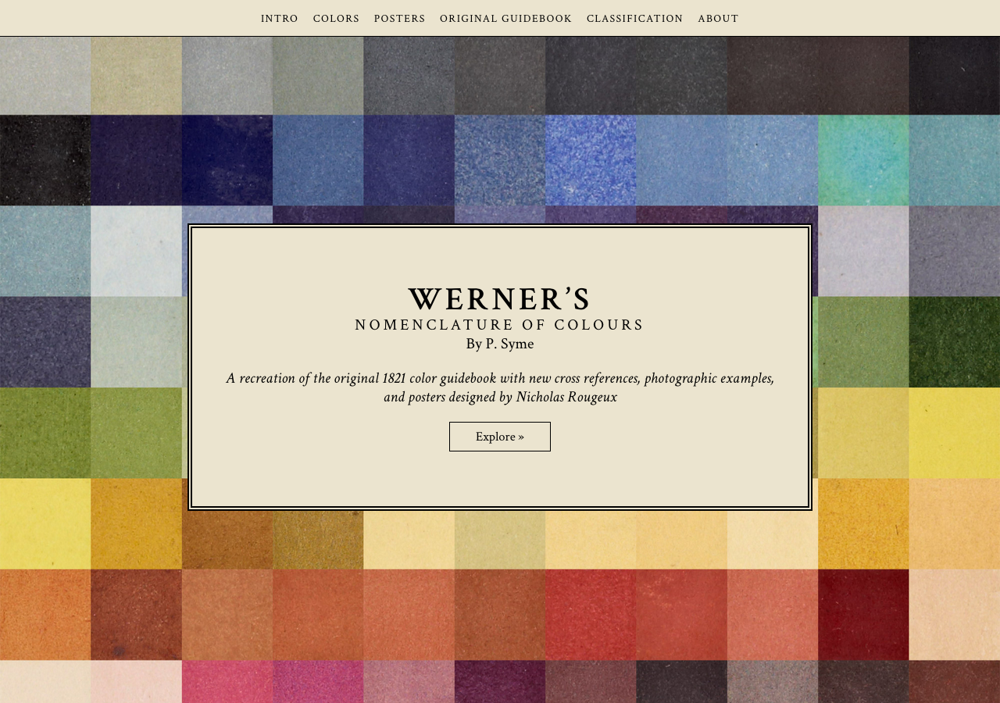
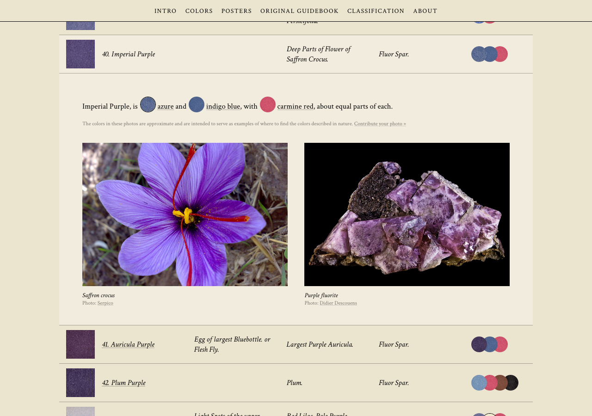

https://www.c82.net/werner

This is a stunning piece of web work. I can’t help but think about the [[paper-like_web]] concept.

The website author, Nicholas Rougeux, did an excellent work. It’s now possible to see this work in a new, more modern format, and otherwise it would go unnoticed, sitting there in the archive.

I already added it to my favorites. I want to be able to use it as a reference for my drawings and paintings, and maybe for web projects.

I like how this catalog, originally manually, created and painted by Patrick Syme, was, in its turn, based on Abraham Werner’s **textual, literal, in-written descriptions of his own experience observing the colors**. It’s crazy! How difficult it must have been to understand which color he was talking about just by reading it. There’s a huge margin for error, but the result is beautiful anyway. I like that I can search, on my own initiative, for the color in real life, like a painter would in the year 1814.

