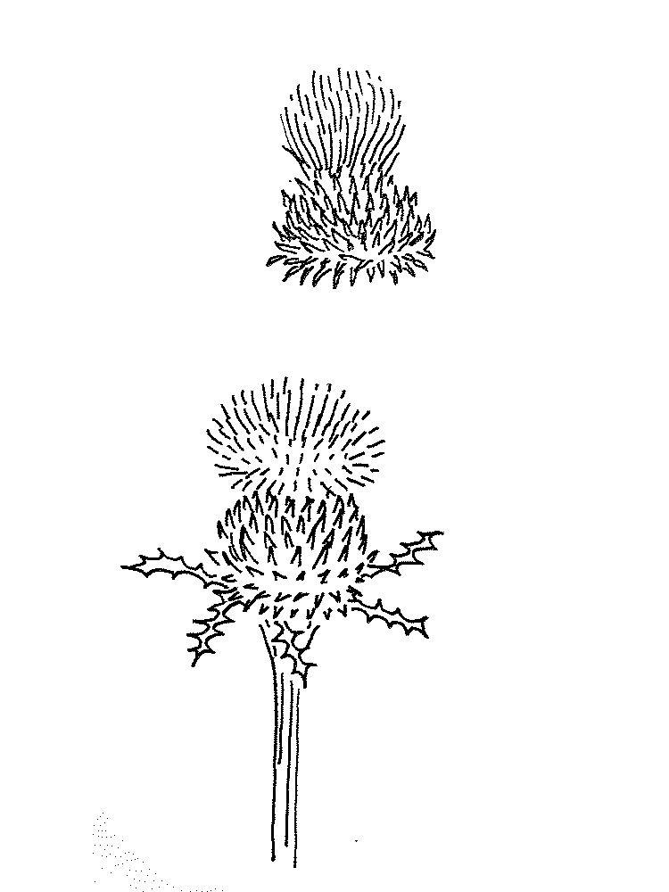
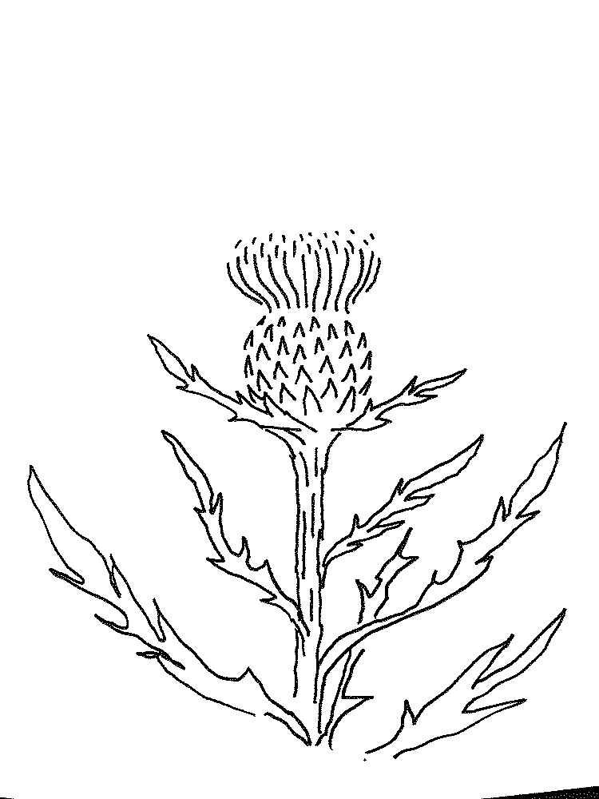
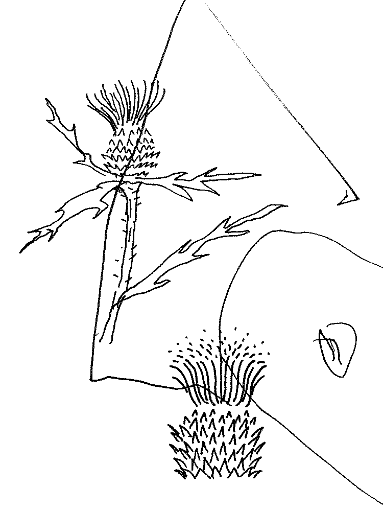
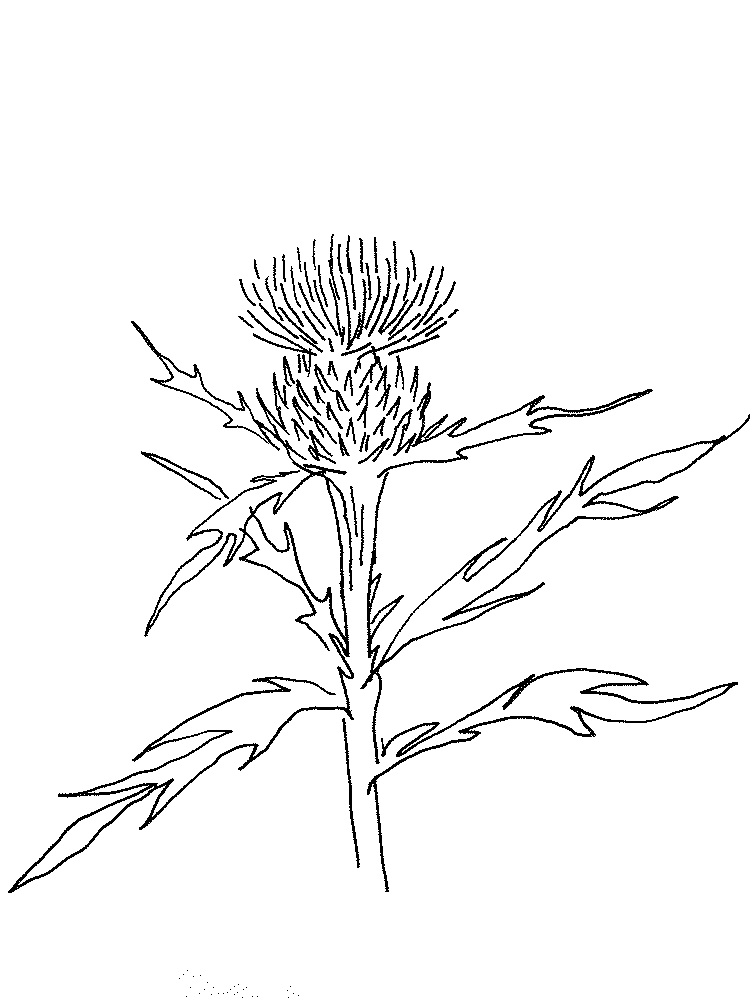
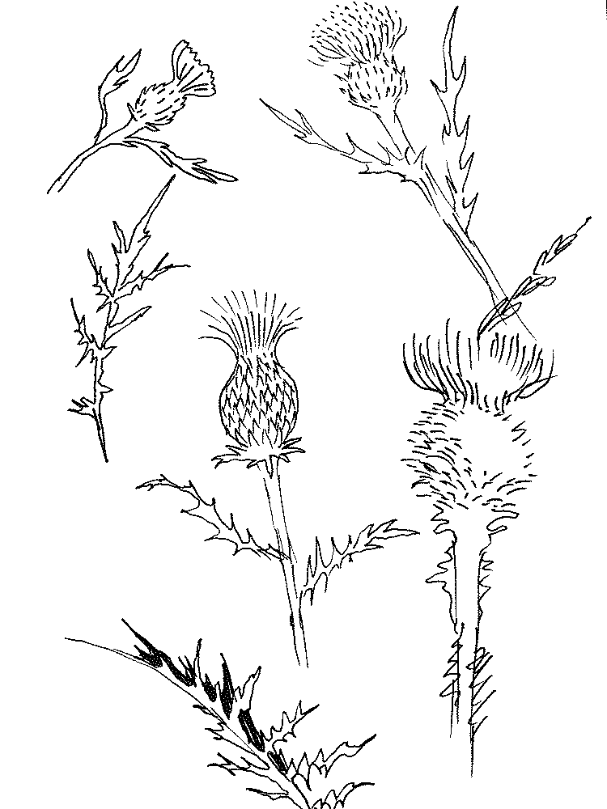

Doing some drawing exercises around cardoons, or thistles.

My family name is Cardoso, and it’s a name derived from the cardoon significance, where this family crest has a cardoon on it and means they were/are located in lands with many thistles, which is true in central Portugal. There are records of this name since from around the year 1100. I am not sure if this is precise, but it’s very medieval and makes a deeply rooted person to this kind of history.

I am looking to examine how a cardoon is made, visually, so I can create some artwork for my next personal website. Also looking to honor this family name with very good, humble women and men that walked this earth with a lot of sacrifice for the newer generations like me. At least the ones I know of.

