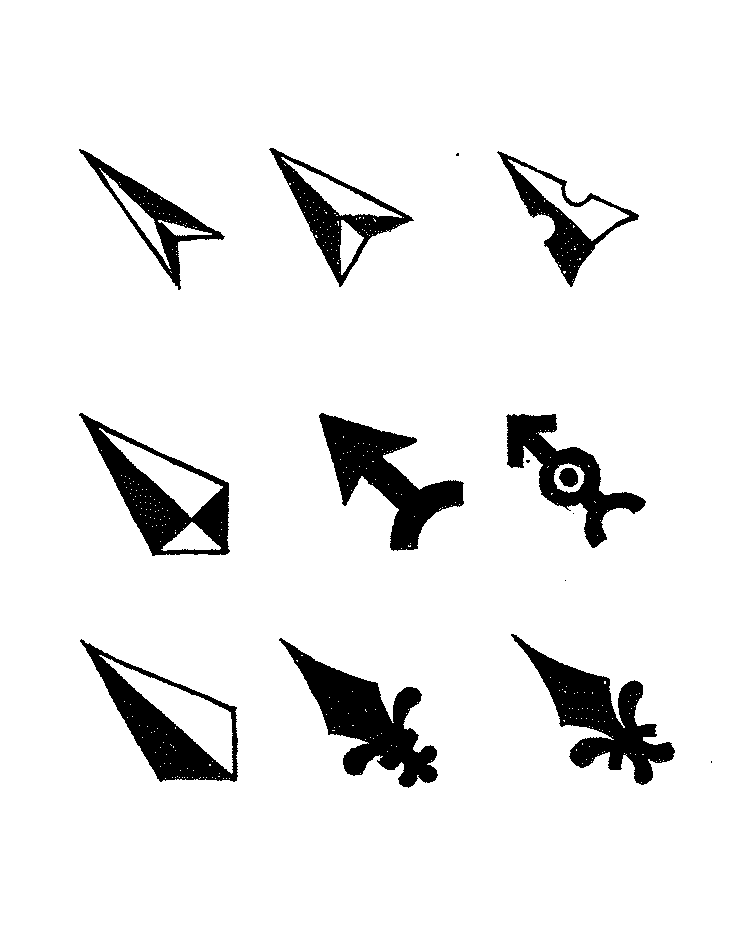

Quick study on mouse pointers designs. I want to make something inspired by nautical instruments. Kind of like a compass needle but more akin to a regular mouse pointer. I would rather not confuse people too much, so it’s effectively a mouse pointer.

Or maybe I could go radical with the _fleur de lis_…

I think I’m going forward with the second one. There’s enough in it that points into nautical and cartography context, but it still looks familiar enough.

