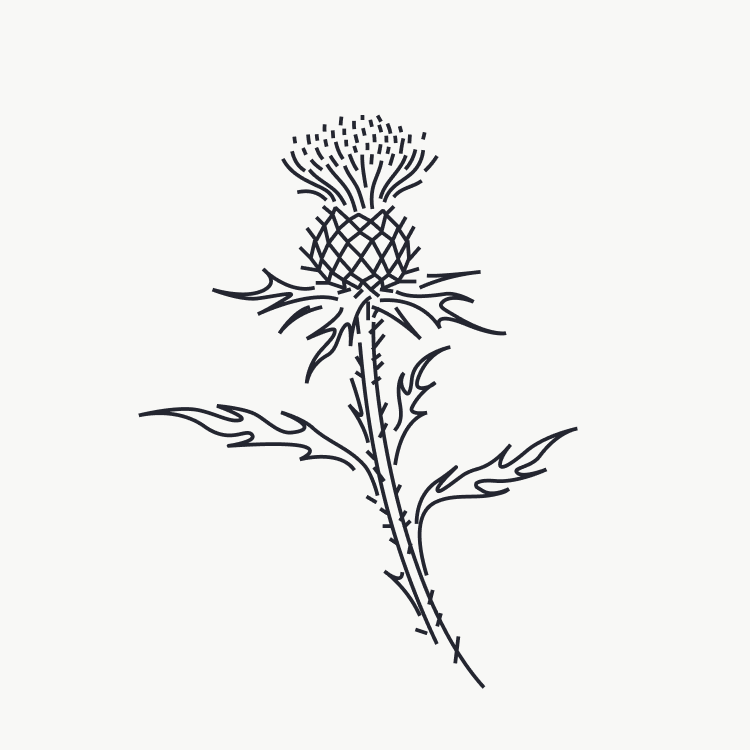
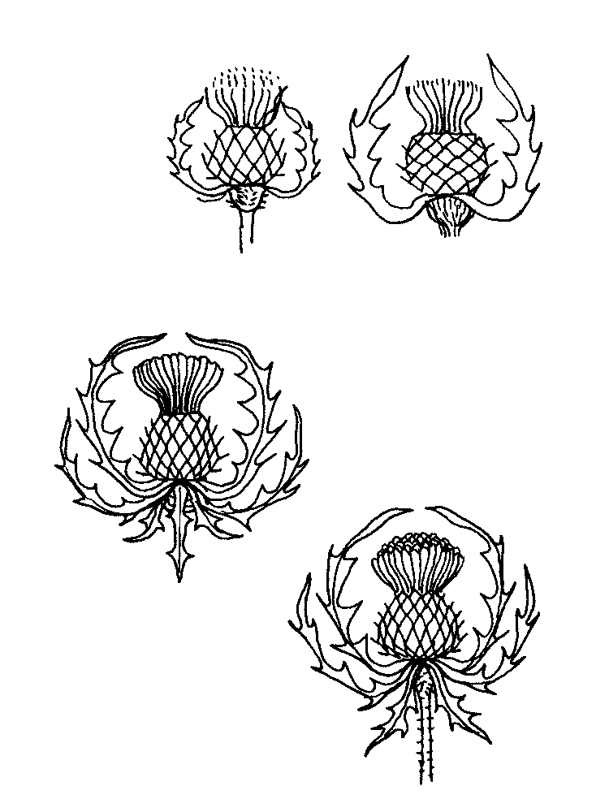
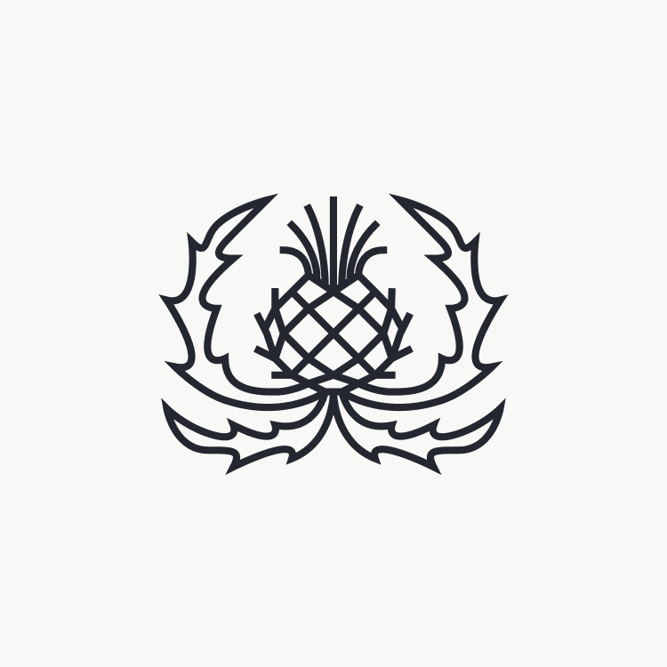
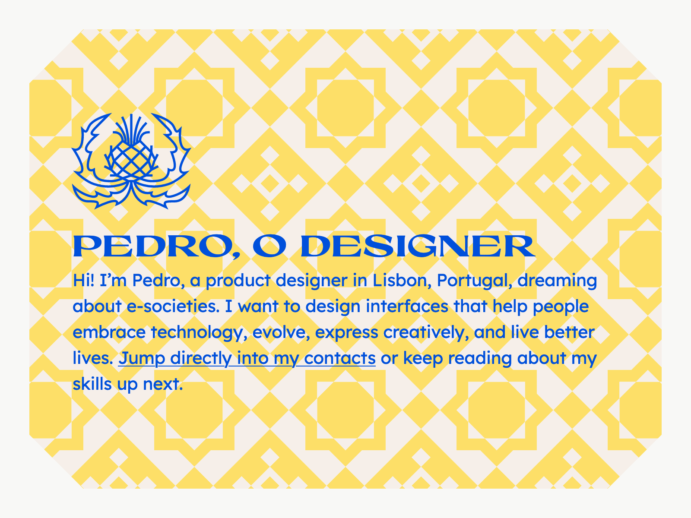

I recently launched a new front-end for my personal website: [PMCF.XYZ](https://www.pmcf.xyz). In the process of designing, I got plenty of loose ends. As I was coding, I was still deciding on some details and iterating on it.

I knew from the start that I wanted to include some cardoons, either illustrated or as a logo of some sort, a symbol. I wanted that as it had a significance to me, it’s related to my family name. So I started [sketching it](<202311 November/2023112313.md>) to see what could come from it.

My immediate thought was to make something more organic and somehow poetic. I already sketched some, so I jumped too soon into vector editing.

I do think it looks good, but it wasn’t working, so I decided to sketch a different approach in trying to create a crest of some sort.

And then I got to a result that really pleased me.

It’s precisely what I was looking for. I just didn’t know about it because I got clouded by a romantic, theatrical idea of a cardoon from other inspirations I got online. It would never pair well with the idea of product design. Sure, I could play with that contrast, but, in the end, it would pass a wrong impression about what I really wanted to message and would always have to eventually explain what it meant.

A crest, or effectively a logotype, is just something more accepted and with a prepacked significance of “it’s the logotype, so I don’t need to know what picture it is… for now”.

I think it makes the website look good and after asking around it does pass a slight idea of a crest which is what I was originally thinking before all of these deviations.

