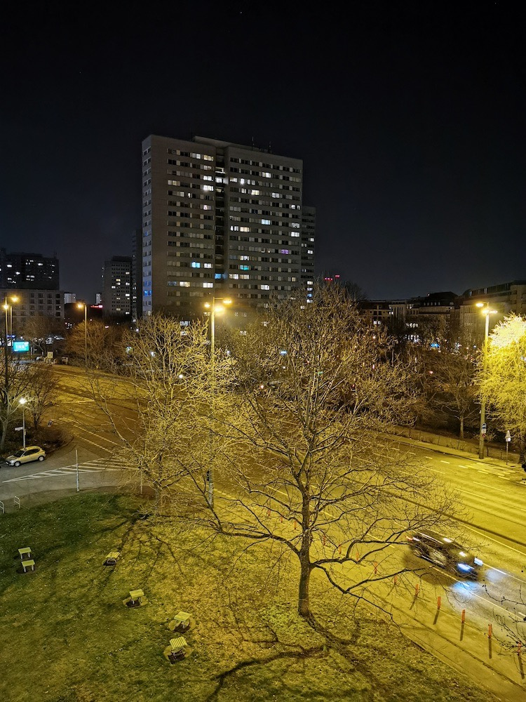
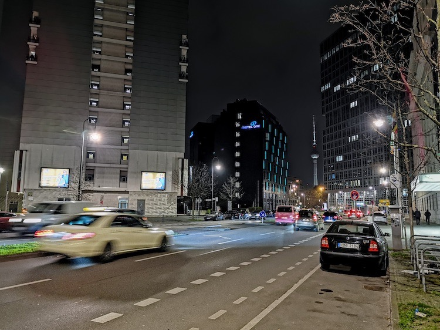
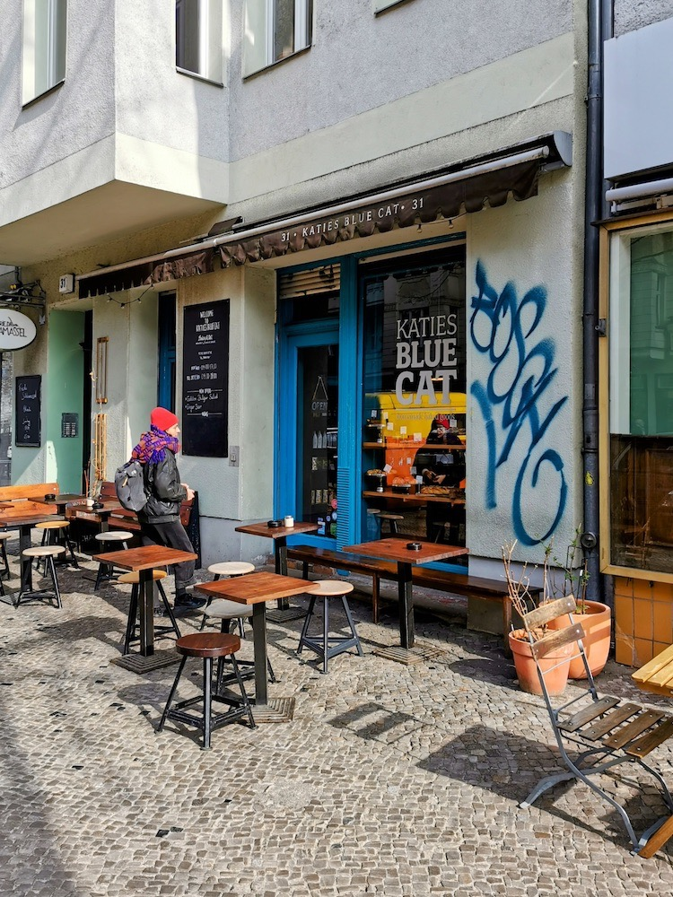
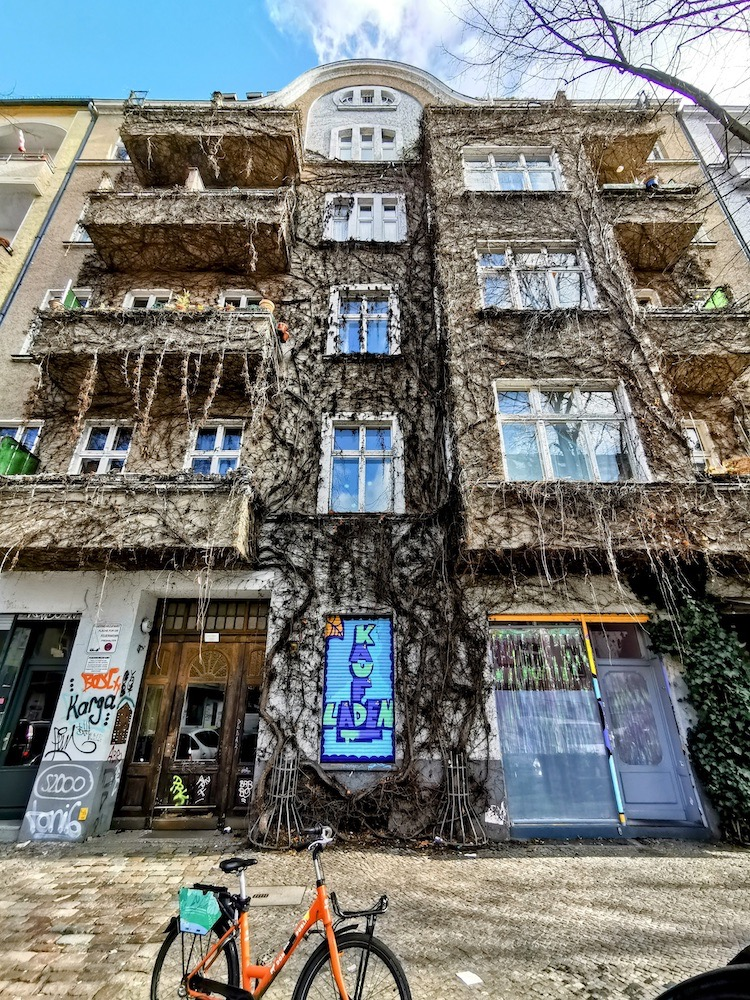
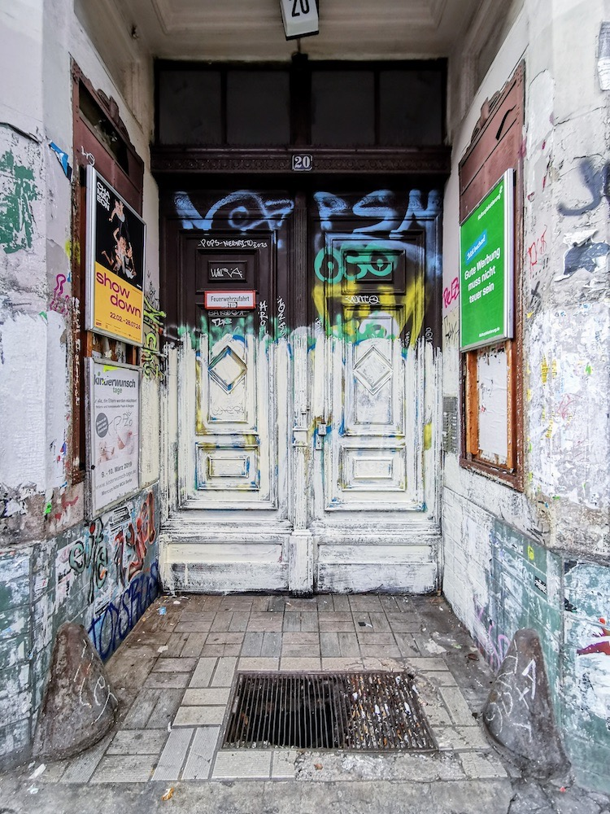
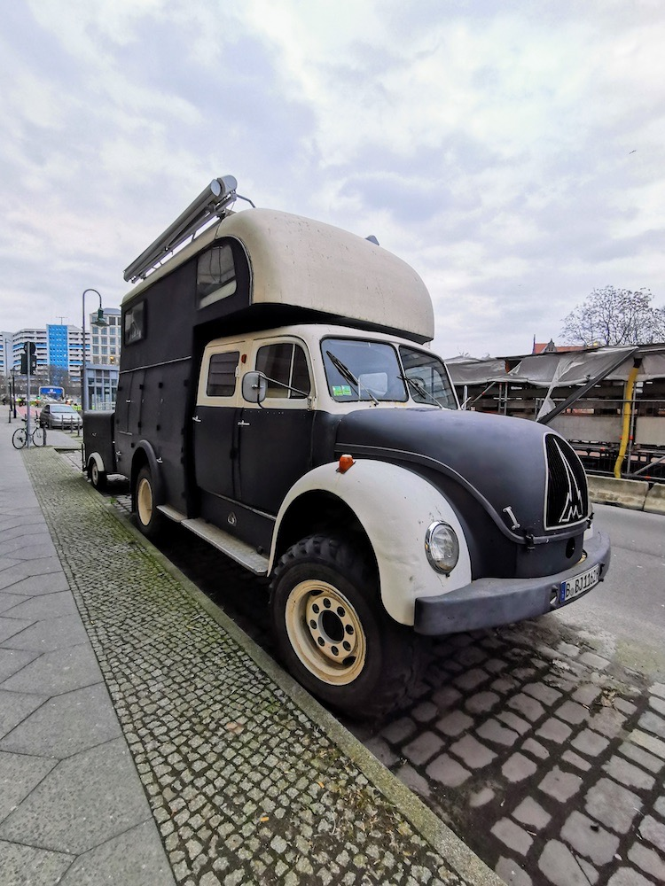
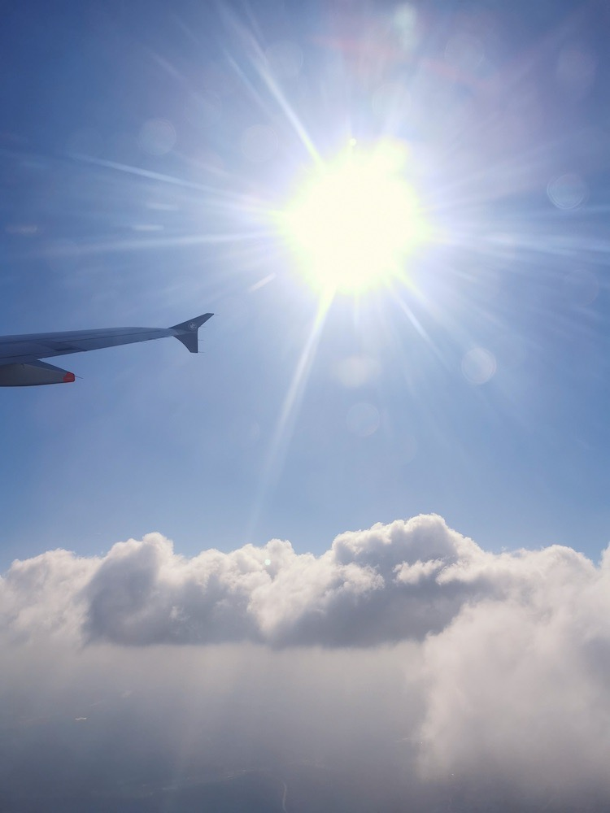

I visited Berlin this last week to attend an open-source software conference: the FOSS Backstage, plus the extra day dedicated to design.

Percona sponsored my visit, which I appreciate a lot, and we got the chance to give visibility to what we do in the database software and services space. But also I got the chance to take personal advantage, from not only this event and its people, but also from the city.

Looking back, the conference was useful. The venue was very cool and comfortable. The people attending were friendly and genuine, which makes me love open-source more. Food was great, vegetarian, fresh. I liked it. 

The need for design in open-source surprised me and made me confident. The talks were a bit underwhelming with some of them being lower in quality, unprepared, lacking substance. However, the topics were on point, needed, and I’m looking forward to following them from here on.

During the stay, the weather was dry and sunny, which helped a lot to walk around. And it was appropriately cold for a city like Berlin. It just feels right to walk on a cold night.

The conference venue was in Paul Lincke street, which is a great place to be to escape and explore.

I had lunch at Katies Blue Cat. It was a great meal. Everything looked fresh. The bread and pastry seemed truly homemade and natural, and obviously tasted good for me to be talking about it. Highly recommended stop.

I tried to maximize my lunch hour because small businesses close early in the afternoon, so I started on the sidewalks right after.

I stopped at Stadtlichter bookstore. Picked a couple of slim books for my flights. The lady there was helpful and had a persistent, warming smile. The bookstore is huge and has a vast selection of women authors.

I entered the Mayara kids store, to see what I could get for my daughter. Again, a helpful lady and the store, despite small, had one of the most creative selection of toys for kids as well as their own clothing label. Picked a shirt and a memory game for my 18 months kiddo.

One of those days I also got the chance to stop at a Modern Graphics bookstore in Kreuzberg. They had nearly everything and stayed there for almost 1 hour. I picked a bunch of Olivier Schrauwen softcovers and left as quickly as I could before I could get the jumbo hardcovers I wanted. They’re incompatible with economy flights…

Need to return to Berlin. There is so much more to see and, at the same time, I want to return to the same stores.