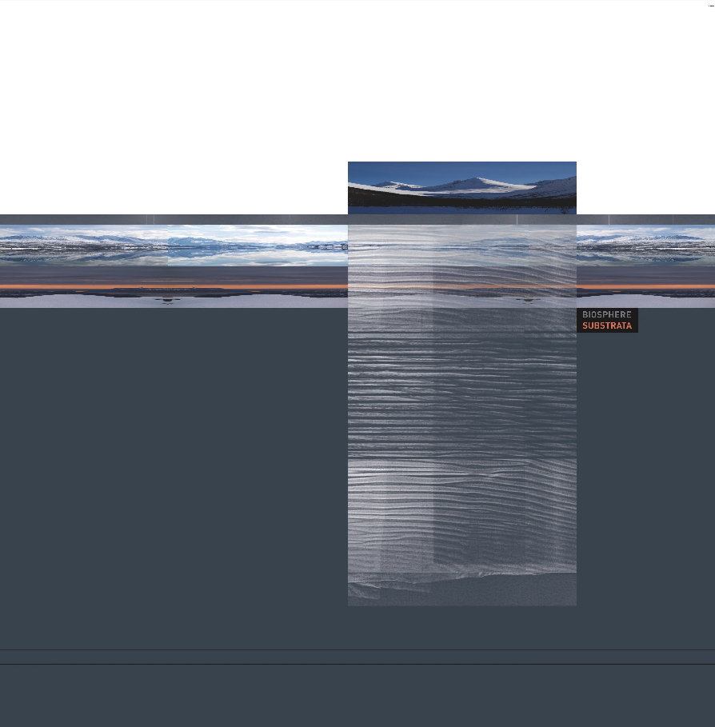
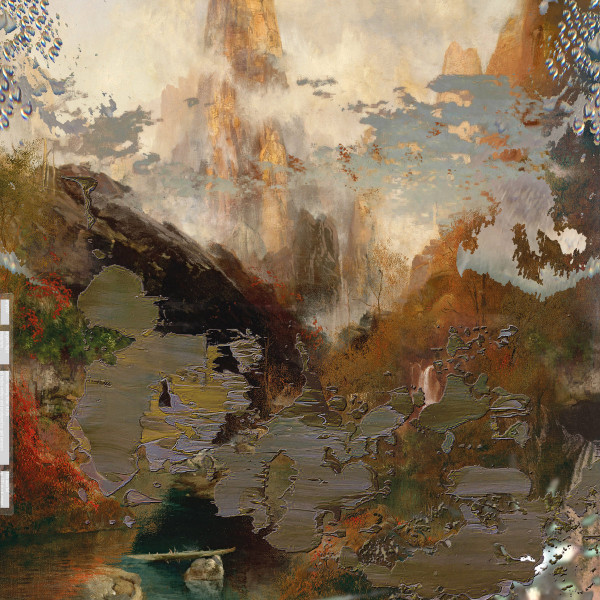

## Substrata

I like the artificiality that is very much present but at the same time providing warmth and life. Skillful and interesting to listen to during office hours on calm days.

## Angel’s flight

Impactful and subtle with good “ambient hooks” that mixed with Beethoven’s music makes it sublime and relaxing to listen to during inspiration sessions.

