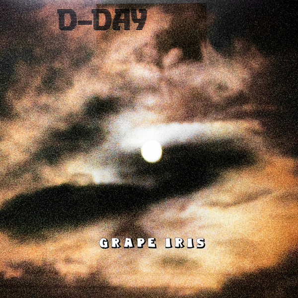
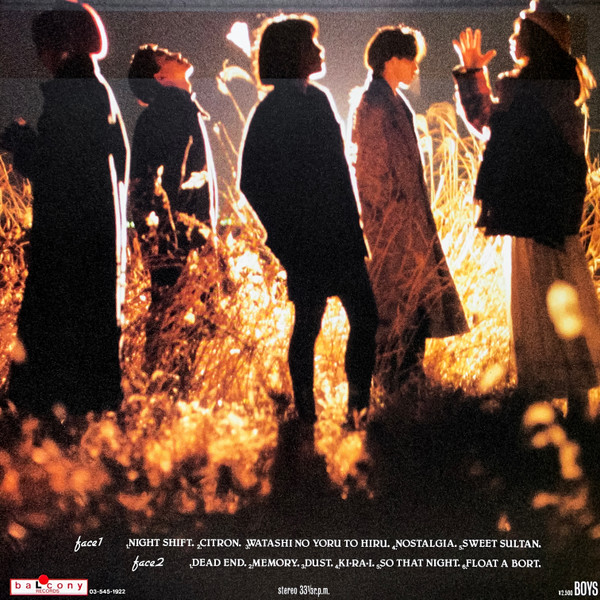

## Grape Iris

It’s just a wonderful ride through a mishmash of styles and, strangely, it all blends in very well. Doesn’t seem like a popular album as well. It’s one of those rarities I’m pretty happy to add to a #party_playlist.

LP cover:

Back cover:

