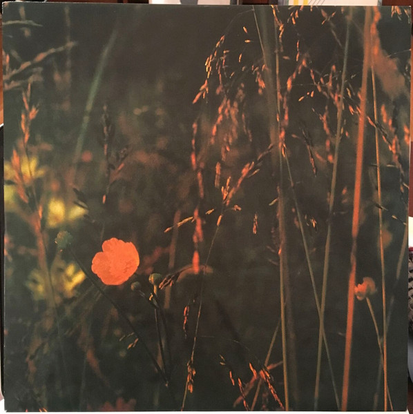
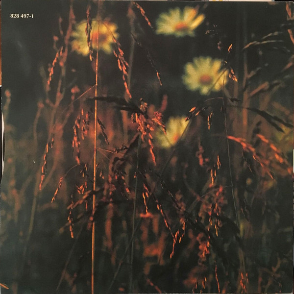
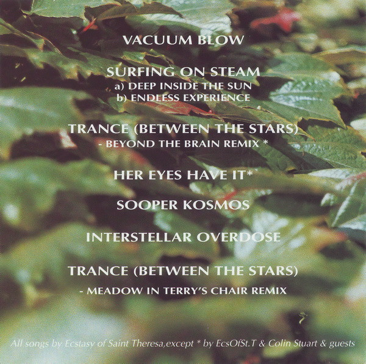

## Free-D

[Album on Discogs](https://www.discogs.com/master/21387-The-Ecstasy-Of-Saint-Theresa-Free-D-Original-Soundtrack)

Soothing and up my alley. It has a little bit of slow post-rock vibes and some lounge-y trance with pastoral sounds, like cows, chickens, birds… A bit of a weird mix, but it’s still very much enjoyable and somehow relaxing.

###### LP cover

Nice imagery on the LP.

###### CD cover

I like the humble typography work here.

