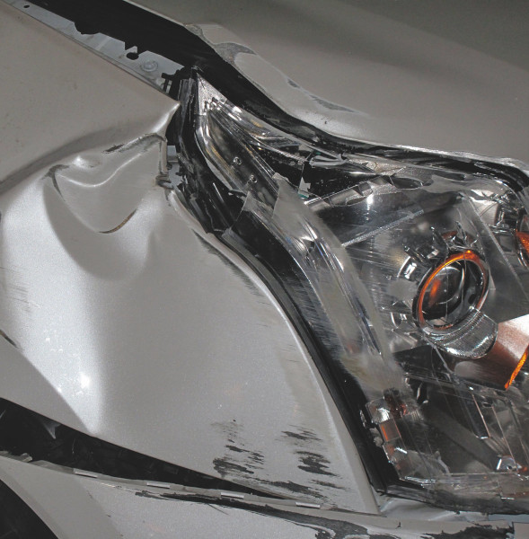

## Collex

Well-balanced album that surfaces a lot of what I like in dub techno but in a different kind of way. It’s more synthetic, metallic and mechanical, glitchy, as in the 90s experimental wave of techno. I prefer this to listen to while working rather than trying to relax.

I find the cover hypnotic and suitable.

