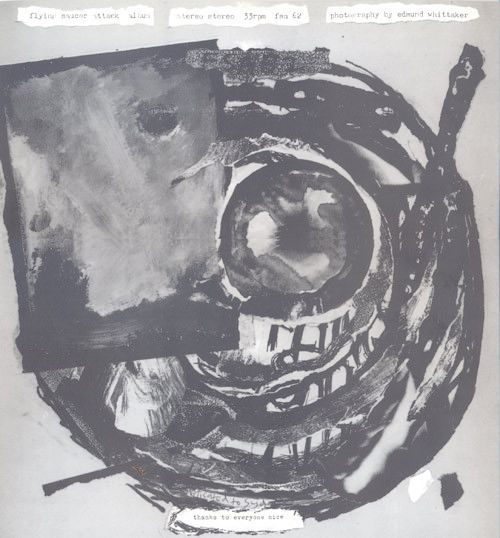
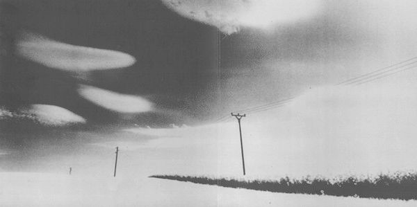
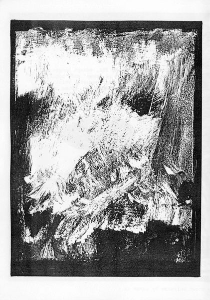
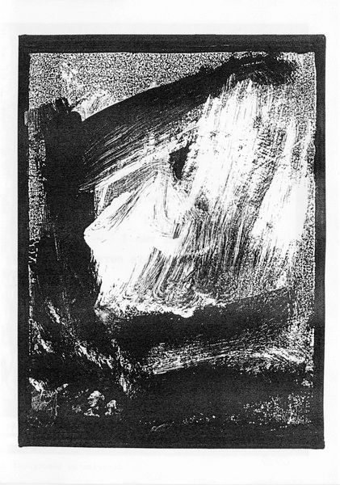
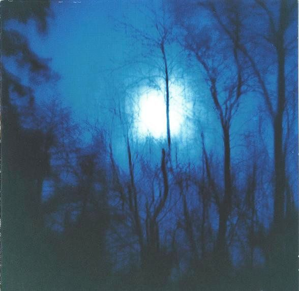
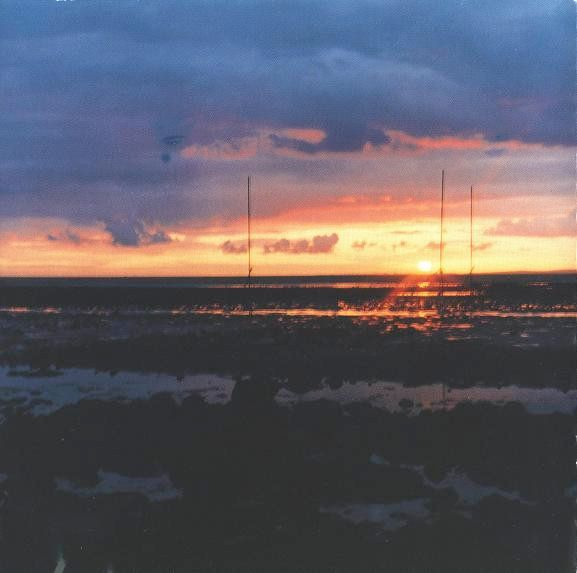
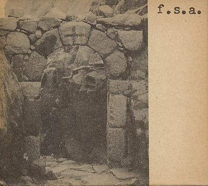
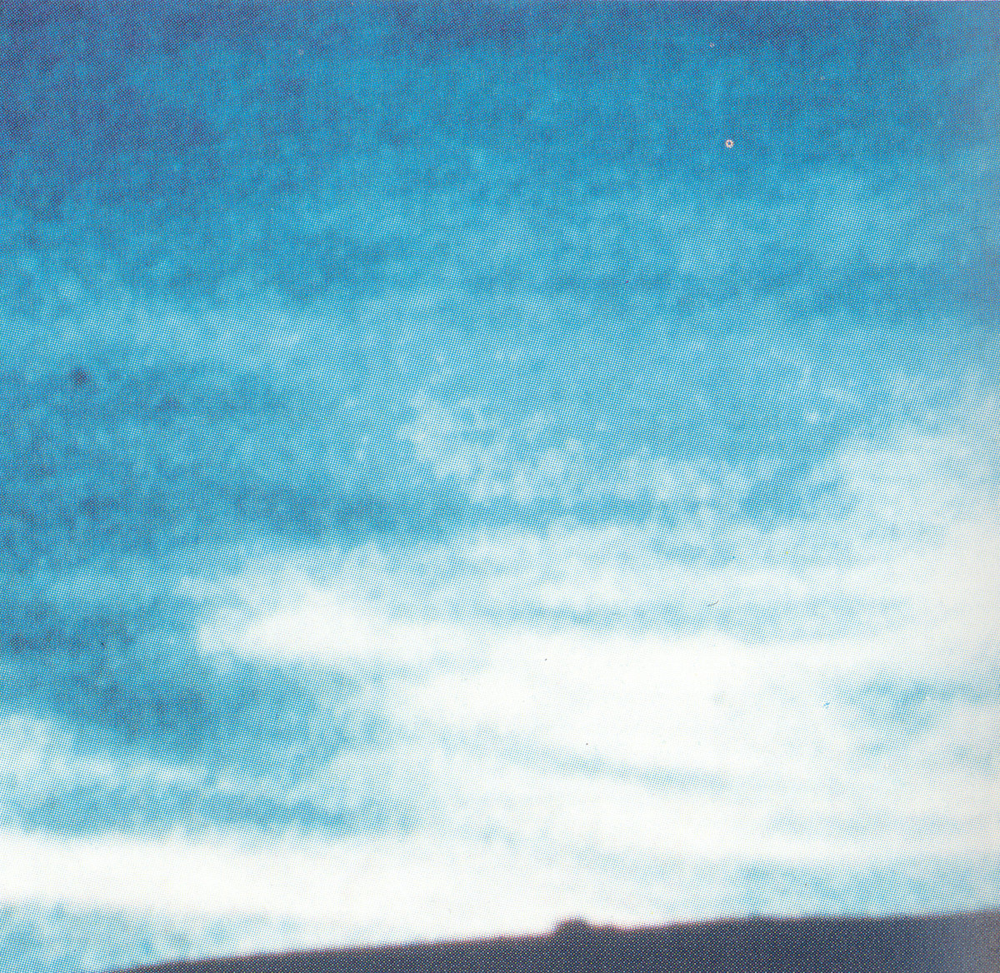
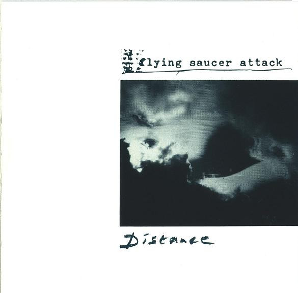

## Self-titled

https://www.discogs.com/master/21723-Flying-Saucer-Attack-Flying-Saucer-Attack

Dirty, grainy, reverberated guitars. Just how I like it. Channeling some Jesus and Mary Chain. All tracks are go. The Suede cover is excellent. The ambient tracks are a delight.

###### LP cover

I prefer the packaging of this LP over the other version I’ve found on Discogs. The photos and the band’s name bind very well, looking a bit eerie.

## Further

https://www.discogs.com/master/21727-Flying-Saucer-Attack-Further

###### CD cover

## In search of spaces

https://www.discogs.com/master/1274772-FSA-In-Search-Of-Spaces
###### CD cover

## P.A. Blues

Raw and intense clashing. I like how it turned into this dirtier, kraut-ish, radical style.

https://www.discogs.com/release/439771-Flying-Saucer-Attack-PA-Blues

###### CD cover

## Distance

Fuzzy and warming. I like the mood this album puts on. It’s like I’m transported to a different dimension without the cheesy hippie stuff, just dreamy noise clouds that elevate you elsewhere to be inspired. Very creative sonic scapes.

https://www.discogs.com/master/21715-Flying-Saucer-Attack-Distance

###### CD cover

