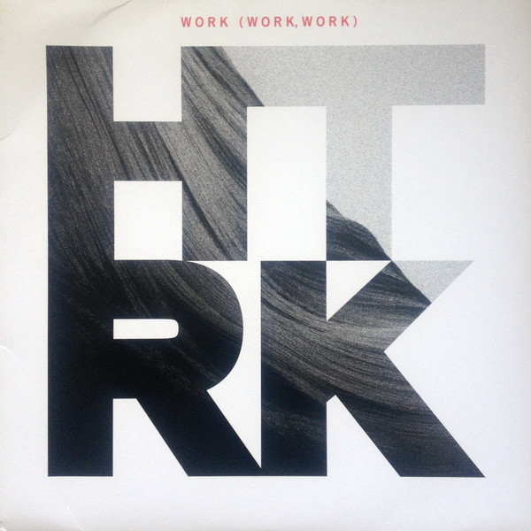

Related to [Joninne](jonnine.md), HTRK singer.

## Nostalgia

Incredibly satisfying to me. It sounds like motorized rock with the metals shimmering and the bass filling in the space. Also like the sound dirtiness captured in the recording.

[Discogs](https://www.discogs.com/master/190793-HTRK-Nostalgia)

## Work (Work, Work)

Approachable and simple album with excellent melodies and trance-y motorizations that goes a lot to the #industrial side of things.

[Discogs](https://www.discogs.com/master/373946-HTRK-Work-Work-Work)

LP cover:

