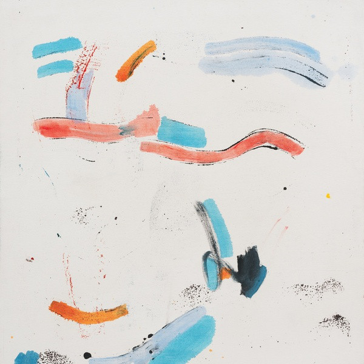
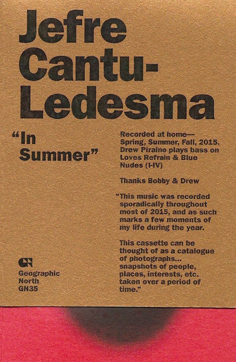

## Music from the Headlands Center For The Arts, volumes 1 to 7

Like the experimental quality and how unexpected they sound. Great for work and to trance. Sometimes ethereal. Sometimes dirty and grainy, melancholic. Energetic, simple, surprising. A good layering to enjoy throughout.

I enjoy this type of uncompromised art, and it reminds me a lot how it should be most of the time: instinctive. My sole, humble opinion.

[Gift of Tongues](https://www.discogs.com/master/826113-Jefre-Cantu-Ledesma-Gift-Of-Tongues), [Archaic Torso](https://www.discogs.com/master/826112-Jefre-Cantu-Ledesma-Archaic-Torso), [The Burnt House](https://www.discogs.com/master/826109-Jefre-Cantu-Ledesma-The-Burnt-House), [A World Apart](https://www.discogs.com/master/826108-Jefre-Cantu-Ledesma-A-World-Apart), [Wild River](https://www.discogs.com/master/826107-Jefre-Cantu-Ledesma-Wild-River), [Disappear](https://www.discogs.com/master/826106-Jefre-Cantu-Ledesma-Disappear), and [Another Void](https://www.discogs.com/master/826105-Jefre-Cantu-Ledesma-Another-Void).

## A year with 13 moons

[Discogs](https://www.discogs.com/master/817005-Jefre-Cantu-Ledesma-A-Year-With-13-Moons)

## In Summer

[Discogs](https://www.discogs.com/master/1488757-Jefre-Cantu-Ledesma-In-Summer)

