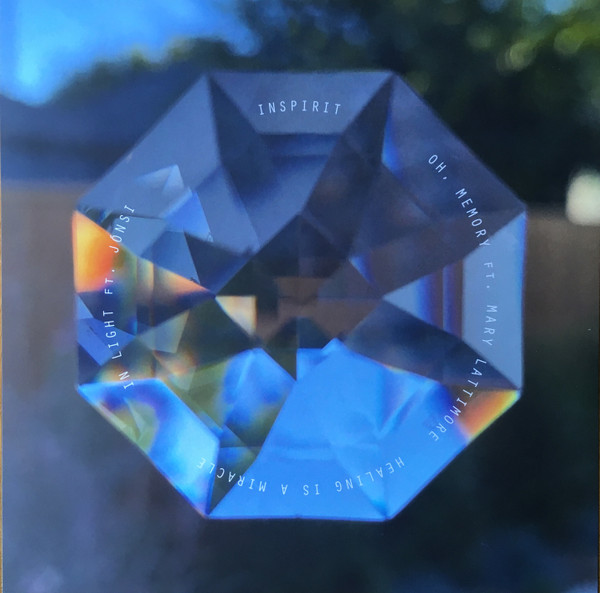

## The Magic Place

I risk saying this is probably in my top 50 albums of my life. That is saying a lot because I listen to a lot of music and I have numerous favorite records. This makes me meditate and quasi transcend of how good it makes me feel. It’s like I’m listening to the soundtrack of being born, living and dying, all juxtaposed while the album lasts. I don’t even know what I’m writing.

Superb record to listen to in the office, for example during a creative exercise.

[Discogs](https://www.discogs.com/master/311970-Julianna-Barwick-The-Magic-Place)

## Healing is a Miracle

Takes me back to The Magic Place with an extra layer of electronics that are very well interwoven. The electronic bass chosen in tracks like “Flowers” is a bit cheesy but up my alley. And I can never get tired of reverb.

I don’t like the Sigur Rós induced moods and melody garnishing, like in the track “In Light”. In this regard, I prefer very much the minimalist vein reclaimed from The Magic Place.

[Discogs](https://www.discogs.com/master/1769776-Julianna-Barwick-Healing-Is-A-Miracle)

LP artwork

