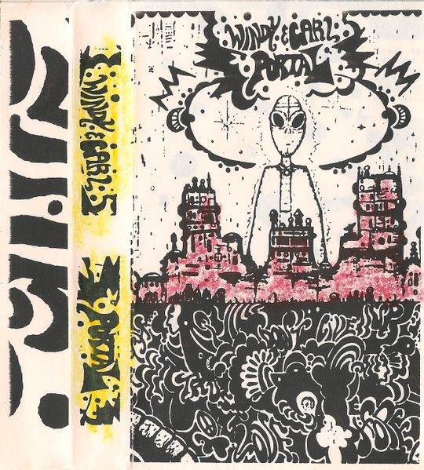
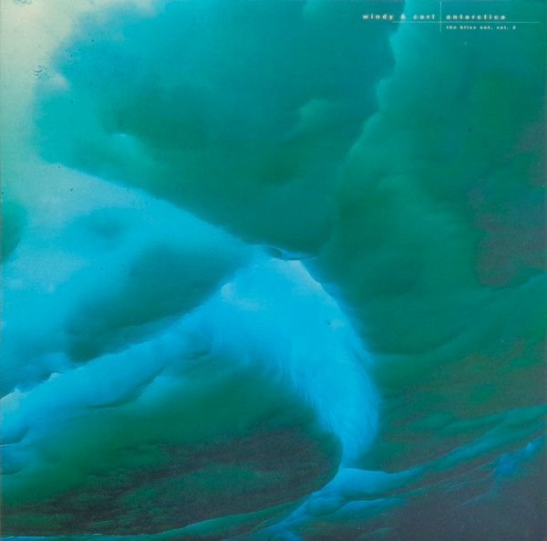
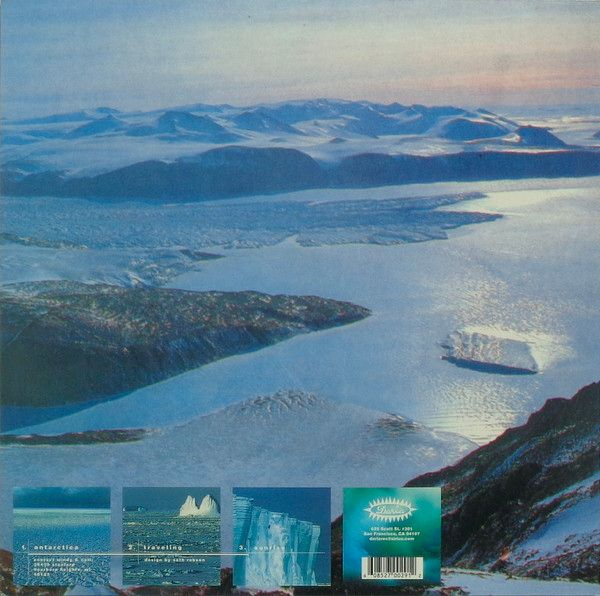
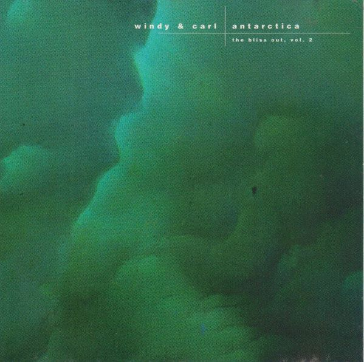
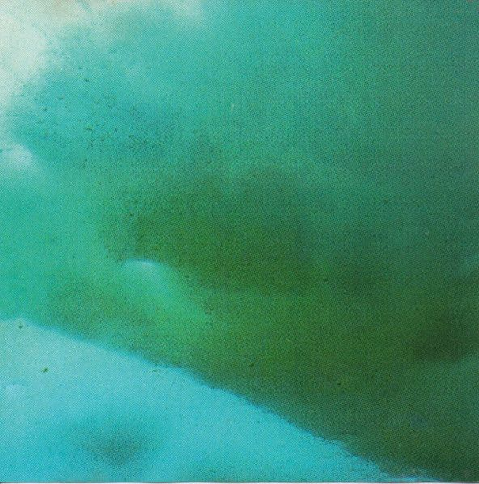
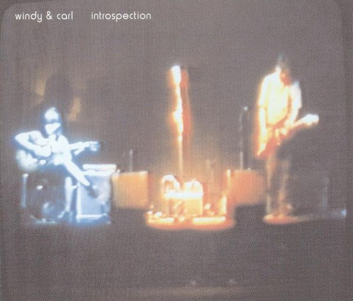
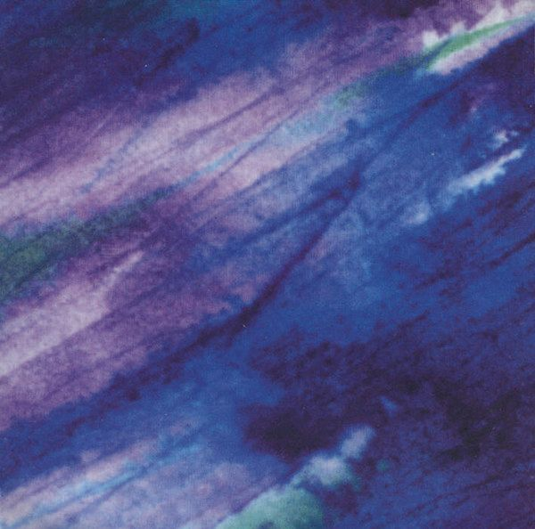
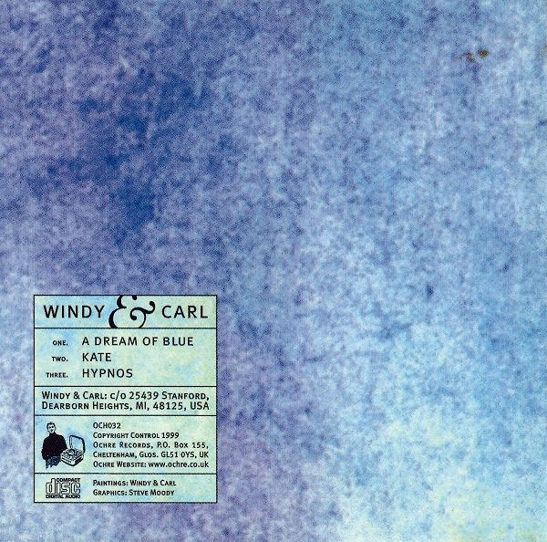
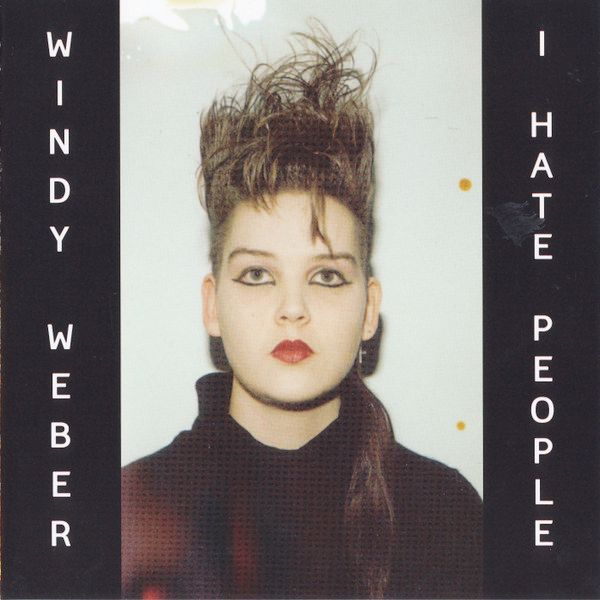
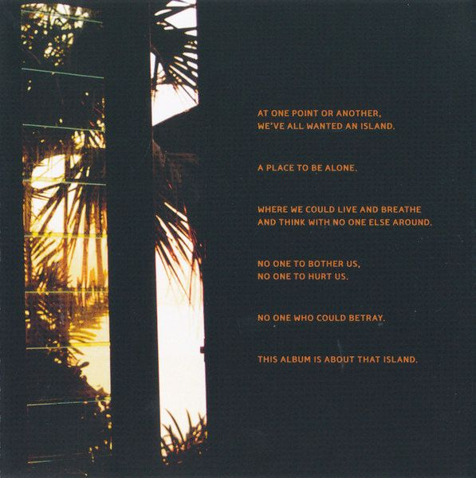

Some of my favorite albums, and also my favorite covers, pasted into this document:

## Portal

https://www.discogs.com/master/851548-Windy-Carl-Portal-

Magic, spacey, enthralling. It’s like drug-music that keeps repeating the pattern with slight shifts, and it entrances the mind.

###### Cassette sleeve

## Drawing of sound

https://www.discogs.com/master/9750-Windy-Carl-Drawing-Of-Sound

## Antarctica

https://www.discogs.com/master/9747-Windy-Carl-Antarctica-The-Bliss-Out-Vol-2

I like this one a lot. It’s more repetitive and minimal but has a lot of heart and swinging subtleties that soothes the mind. It’s less psychedelic and more introspective, in my view.

###### LP cover

###### CD cover

## Depths

More refined, ambient-structured and drone-y.

https://www.discogs.com/master/9758-Windy-Carl-Depths

## Introspection

A collection of singles and rarities between the years 1993 and 2000. Super-worth, beautiful and inspiring. A very long play distributed into three compact discs.

https://www.discogs.com/master/1178847-Windy-Carl-Introspection-Singles-Rarities-1993-2000

I’m a sucker for drone tracks like “Song for ‘After the flood’”. It’s like a big, voluminous cloud traversing my mind, and leaves me in a positive creative mood.

###### CD cover

## A dream of blue

https://www.discogs.com/master/9744-Windy-Carl-A-Dream-Of-Blue

It’s like listening to a movie. Windy’s voice here is spot on, and sets the perfect mood for me to listen to this. It’s more post-rock than the other records.

###### CD cover

## I hate people

https://www.discogs.com/master/160411-Windy-Weber-I-Hate-People

This one is authored by Windy Weber alone. I enjoy this one too much. I’m in the same club as Windy.

I suspect this album may aggress most people. It’s desolated, it’s isolated. Feels more like an arid desert. Tastes like sand, and it’s windy (no pun intended) due to these enchanting vocals and pipes.

I love there’s that undertone of this desolation going on, and this quasi tragedy of being alone. I sense that it’s also celebratory music. Something we are secretly enjoying and is part of a rite for celebrating, and hoping there is no one else around.

I will definitely look for more music like this.

###### CD cover

> At one point or another, we’ve all wanted an island.
> 
> A place to be alone.
> 
> Where we could live and breathe and think with no one else around.
> 
> No one to bother us, no one to hurt us.
> 
> No one who could betray.
> 
> This album is about that island.

<small>Windy Weber’s words included in the album.</small>

## Self-titled

https://www.discogs.com/master/431294-Windy-And-Carl-Windy-And-Carl

I like its pace and progression. Want more of this.

## Unreleased Home Recordings 1992-1995

https://www.discogs.com/master/1758377-Windy-Carl-Unreleased-Home-Recordings-1992-1995

The rawness of these tracks, I just love it. It’s like grainy night or overexposed summery photography. You want that grunge to surface and give it some authenticity because “nothing is perfect”.