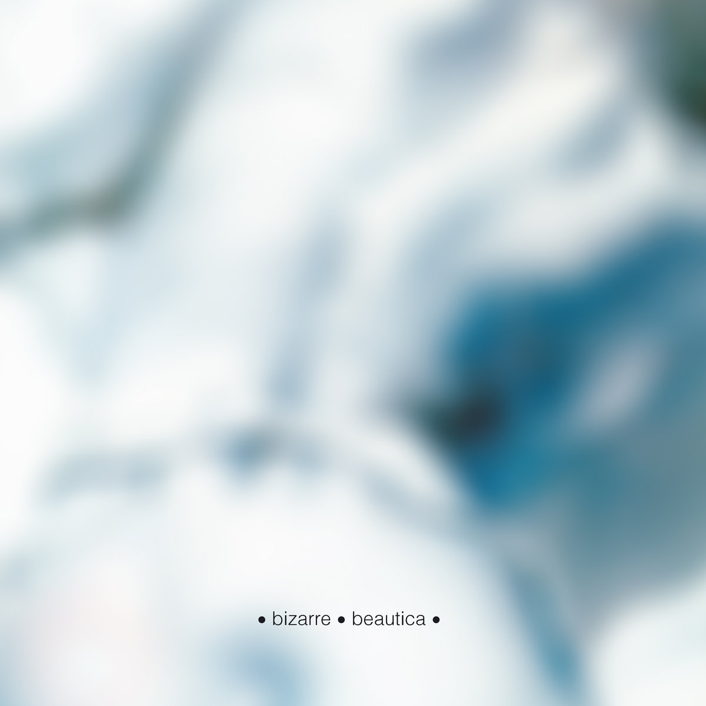

## Beautica

I like the slower pace on this one. Not drastically different from other shoegaze bands, but they have their own sound. I particularly like how crude and muddy it sounds sometimes. It could be considered like a bad production and mastering, but I just love these flawed records and how sincere they are.

[Discogs](https://www.discogs.com/master/1097132-Bizarre-Beautica)

