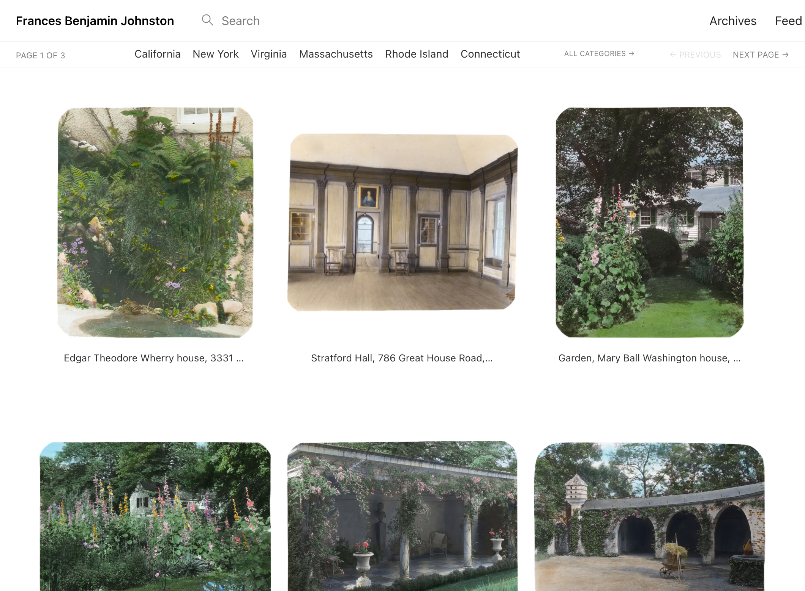
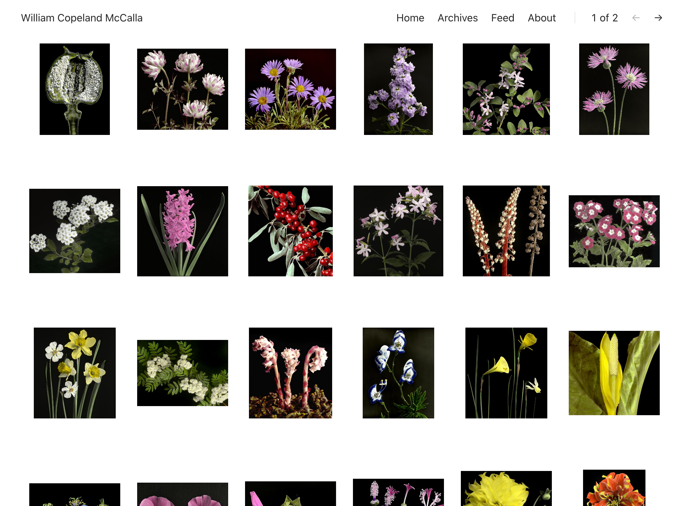

I’m really impressed by this tool’s simplicity as explained in their video.

[Blot’s website](https://blot.im)

I may consider using it:
- As a substitute for my Are.na account, reducing some costs;
- To host my sketchbook, but I’d have to think about the notes flow and how I entangle drawings with notes, so I need to avoid having separate websites for notes.

Example of an Are.na alternative:

Example of a visual-only sketchbook:

