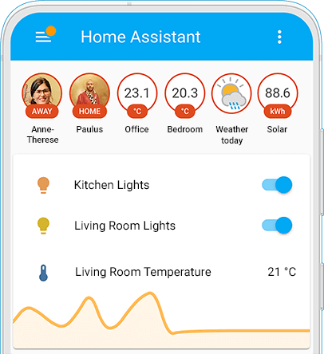

I’ve been on the lookout to connect my home switches to my smart devices, like smartphones, tablets, and computers, but also to other remote devices, like remotes.

## Need

I want the commodity of having everything centralized. I want to be able to manipulate lighting and blinders switches, but also cameras, remotely, either in bulk or individually. The advantage would be able to control while in leisure, adjust the room I’m in or while I am away, to be able to bring down the blinders, turn off the lights, and potentially turn the cameras on.

I already have a camera and a door sensor. It would be great to implement them in the same ecosystem.

### Expansion requirements

- About 6 rooms with dimmable sets of LED lights (any focus-type format) and specifically controllable with a dedicated remote control.
- About 4 rooms/corridors with simple on/off sets of LED lights.
- 3 bathrooms with simple on/off sets of LED lights.
- About 12 motored blinders switchers.

## Connection Technologies

So far, I’ve found Zigbee and Wi-Fi to be advantageous over any other types in the market.

### Connection down

Zigbee has the potential of usage without Wi-Fi. Still not sure if this is a fair advantage. To get the full advantage, Zigbee devices have to be connected to a Zigbee receiving hub so they can synchronize. And to provide some extended functionality, that hub has to connect to Wi-Fi. If I’m away and Wi-Fi is down, I will not be able to connect to my devices anyway.

I guess if the Wi-Fi is down, I can access my devices in sync using a remote and have that connection between devices.

I think it’s just better to guarantee that the Wi-Fi router is in good shape and works for the purpose.
- If electricity is down, no device will work.
- If the Wi-Fi router is down, most smart functionalities will be off.
- If the Zigbee hub is down and Wi-Fi is on, I won’t access my devices.

### Basics

The single most important connection is having electricity and those switches working with it, independently of other networks, regardless if it’s Zigbee or Wi-Fi.

## Software

### Zigbee2MQTT

To find Zigbee devices that will work with each other using MQTT, this is a comprehensive catalog to find specific devices, like a Zigbee remote!

[Zigbee2MQTT’s supported devices](https://www.zigbee2mqtt.io/supported-devices/)

### Home Assistant

A software ecosystem tailored to run and manage all your interconnected devices.

[Home Assistant main site](https://www.home-assistant.io/)

## Devices

- [Home Assistant Green](home-assistant-green.md), costs about 115 EUR.
- [SkyConnect](skyconnect.md), costs about 42 EUR.
- [Sunricher ZigBee Remote](sunricher-zigbee-remote.md)