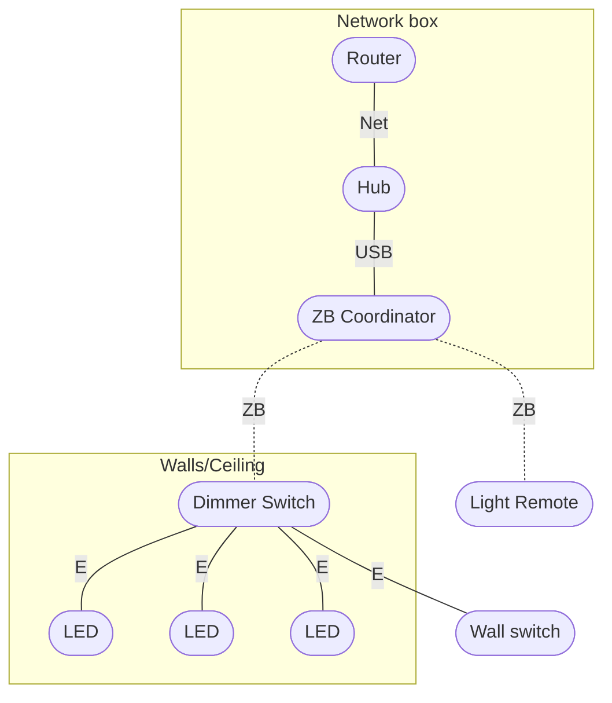

I’ve been on the lookout to connect my home switches to my smart devices, like smartphones, tablets, and computers, but also to other remote devices, like remotes.

## Requirements

I want the commodity of having everything centralized. I want to be able to manipulate lighting and blinders switches, but also cameras, remotely, either in bulk or individually. The advantage would be able to control while in leisure, adjust the room I’m in or while I am away, to be able to bring down the blinders, turn off the lights, and potentially turn the cameras on.

I already have a camera and a door sensor. It would be great to implement them in the same ecosystem.

- About 6 rooms with dimmable sets of LED spotlights (any type) and specifically controllable with a dedicated remote control.
- About 4 rooms/corridors with simple on/off sets of LED spotlights.
- 3 bathrooms with simple on/off sets of LED spotlights.
- About 12 motored blinders switchers.

## Connections

So far, I’ve found [Zigbee](zigbee.md) and Wi-Fi to be advantageous over any other types in the market. Matter also exists, but I won’t bother with it now as it’s just promises at this point (in terms of tech) and apparently Zigbee devices will be supported anyway.

Zigbee has the potential of usage without Wi-Fi. Still not sure if this is a fair advantage. To get the full advantage, Zigbee devices have to be connected to a Zigbee receiving hub so they can synchronize. And to provide some extended functionality, that hub has to connect to Wi-Fi. If I’m away and Wi-Fi is down, I will not be able to connect to my devices anyway.

I guess if the Wi-Fi is down, I can access my devices in sync using a remote and have that connection between devices.

I think it’s just better to guarantee that the Wi-Fi router is in good shape and works for the purpose.
- If electricity is down, no device will work.
- If the Wi-Fi router is down, most smart functionalities will be off.
- If the Zigbee hub is down and Wi-Fi is on, I won’t access my devices.

The single most important connection is having electricity and those switches working with it, independently of other networks, regardless if it’s Zigbee or Wi-Fi.

## Software

- [Home Assistant](home-assistant.md) operating system, FOSS.
- Will be relying on [ZHA](zigbee-home-automation.md) to interface with the Zigbee devices.

## Devices

- **Hub** — [Home Assistant Green](home-assistant-green.md), about 115 EUR. Using it to host my Home Assistant.
- **Coordinator** — [SkyConnect](skyconnect.md), about 42 EUR. The coordinator I will use to interface the Zigbee mesh with the Green device.
- **Remote light control** — For the ceiling LED spotlights. Options are:
  - [Ikea Styrbar](styrbar.md), about 10 EUR.
  - [Philips Hue Dimmer Switch](hue-dimmer-switch.md), about 20 EUR.
- **Dimmer Switch** — To orchestrate a set of LED spotlights. Options are:
  - LED Trading 9106, about 40 EUR.
  - Gledopto GL-SD-001, about 34 EUR.
  - Sunricher SR-ZG9101SAC-HP, about 38 EUR.

## Plan

