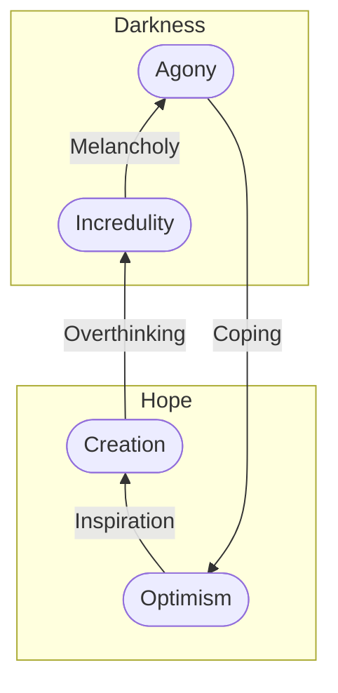

## Context

Existing is painful.

We have our bodies glued to pain. Parts of it are numb, like our brain. Cells are dying because they're permanently under attack. We are surrounded by our aggressive peers, too, an aggressive environment, and we live in an inhospitable universe.

Despite, we live like there's a tomorrow after tomorrow. We hope there's something around the corner and that everything will be fine after that. Even if that were true; fine for what? Or we don't hope anything at all. We just don't think about it, or suppress it the best we can, and carry on, injecting chemicals.

I'm trying to find something that justifies going through the above. 

On the other side, non-existence is just that: nothing. It's emptiness, void and silence, static space. Humans not existing means not having additional motion roaming around in the universe. Motion is merely our essence, nothing else. Nothing exceptional about it. Not existing means not having the chance of “dancing” with the universe.

But by allowing ourselves to be in synchrony with the universe, we collectively and instinctively align to the goal of understanding it. We are motivated to engage people to keep focused on learning it.

We propose to withstand the pain, solve problems, and have chances to see more of the universe. Only because there is nothing else to do. And because it's better to play the rules of motion or face the nothingness. Nada.

## Dor Crónica

I want to write about this, and try to convey somehow positive messages on this. There is worth in living. Not only because one is already chemically motivated to live and exist, but because one can move mountains with the social leverage. We can collectively fight the daily pain, get motivated and integrate the environment, or to “dance” with the universe.

1. Overthinking
2. **Incredulity**
3. Depression
4. **Agony**
5. Coping mechanism
6. **Optimism**
7. Inspiration
8. **Creation**

