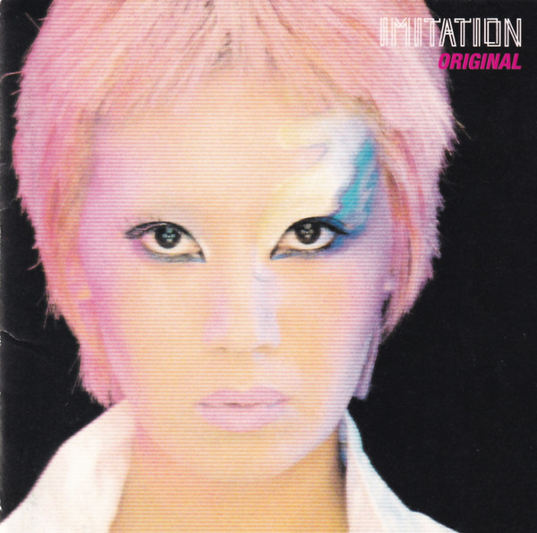

# Original

I got surprised by this one. Very festive, which is something I don’t usually like in music. I prefer more contemplative landscapes. However, I’m also into punk so I had this hanging in my _to listen_ list.

Quite suitable for parties.

[Discogs](https://www.discogs.com/master/754206-Imitation-Original)

LP cover

