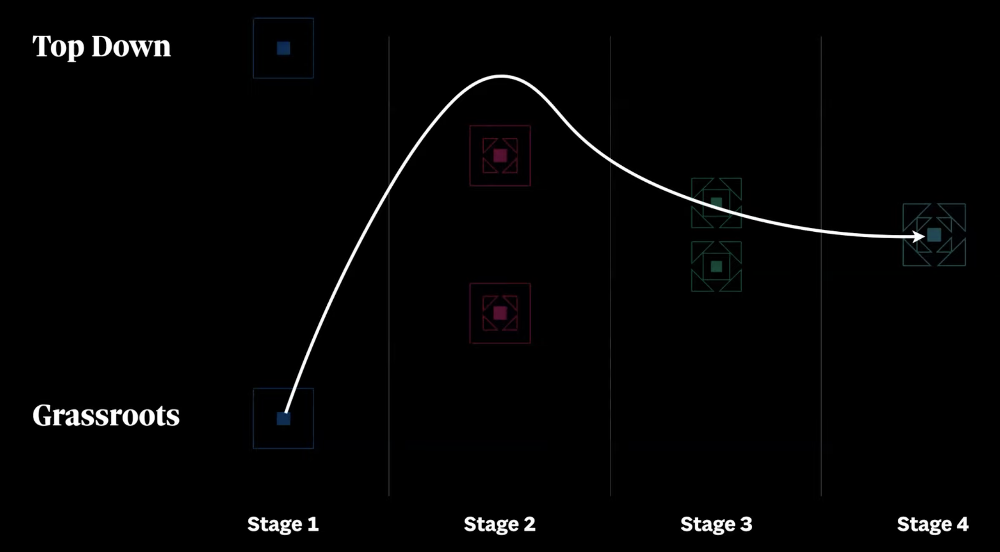
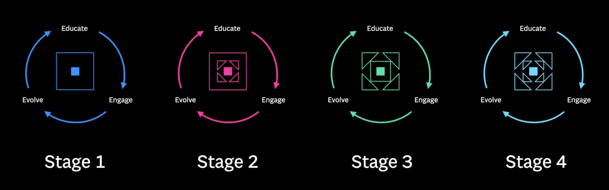

## Maturity stages

1. Building version one — Foundational work
2. Growing adoption — Have people using it
3. Surviving the teenage years — Discovering real-world problems to solve
4. Evolving a healthy product — Sustainability

## Origin

Ben Callahan describes two different points of views in terms of scaling a design system:

- One that comes as a top leadership initiative (Top down)
- One that comes from design necessity (Grassroots)

This forms a sort of spectrum of conditions for design systems to evolve in organizations.

| Top down              | Grassroots            |
| :---                  | :---                  |
| More visibility       | Less visibility       |
| Formal budget         | Informal/no budget    |
| Dedicated team        | No team               |
| Broad scope           | Narrow scope          |
| Leadership pressure   | No expectations       |

Growth can shape differently within this spectrum, to each organization case. For example, take this chart, that shows one can start below and then fluctuate between leadership buy-in and survival mode quickly. The other way around is also possible and has multiple factors affecting it.

## How to mature

Ben describes this as a way to grow between the stages; you continuously practice these actions until at one point, through evaluation, you understand that you can grow to the next stage.

| Educate   | Engage    | Evolve    |
| --        | --        | --        |
| Spread the word | Get others in it | Make it better |
| One-way interaction | Two-way interaction | Iterate and test |

## 1. Building version one

**Educate**

- Define what a design system could be in your organization.
- Share benefits, costs and approach.
- Cast the vision.
- Present it to the broader audience of your organization.

**Engage**

- Discover what will make it right for teams to use — interview, talk with people
- Identify early adopters to use/test

**Evolve**

- Iterate toward the initial release.
- Build a documentation resource.
- Write usage guidelines.

## 2. Growing adoption

**Educate**

- Share each release or evolution bump up.
- Share adoption stories — What little wins could you share to inspire?
- Create and share a roadmap.
- Share the goals and metrics you have defined.

**Engage**

- Gather feedback.
- Get roadmap collaboration — Add your (adopter) own needs to it.
- Support your adopters and, if needed, work closely with them around problems.
- Ask for leadership and adopters support.

**Evolve**

- Documentation to use and effectively adopt it.
- Strategically help it grow by:
  - adding requested features
  - fixing pressing issues/bugs

## 3. Surviving the teenage years

**Educate**

- Capture and share the analytics.
- Effective way to communicate to adopters.
- Explain how to contribute.

**Engage**

- Have design system personnel working in projects.
- Have adopters working sporadically on contributing.
- Directly help onboard into full adoption.
- Have a long-term leadership commitment to support it.

**Evolve**

- Well-oiled and working contribution model.
- Space to add components and guidelines.
- Improvements requests popping up.

---

Credits to [Ben Callahan](https://bencallahan.com/) that presented these tips in “A Maturity Model For Design Systems” shared in YouTube’s video published by Into Design Systems channel. Images of diagrams are screenshots from Ben’s presentation.

Most of these are notes that I took while learning. It is not exactly “vanilla” in the sense that I added or tweaked around according to my own experience with building design systems. I would say it’s about 5% to 10% my own input.