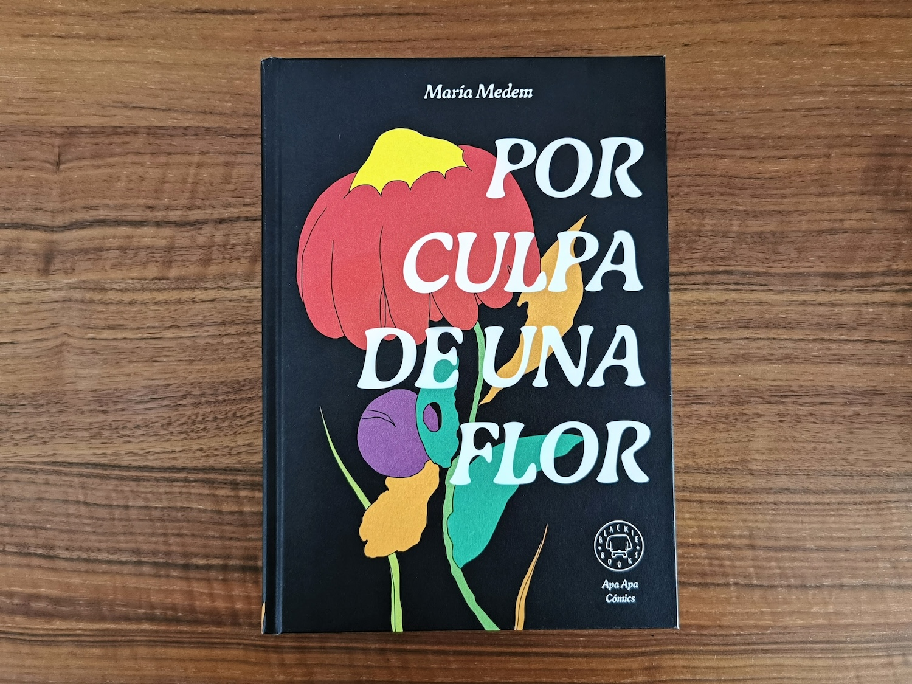
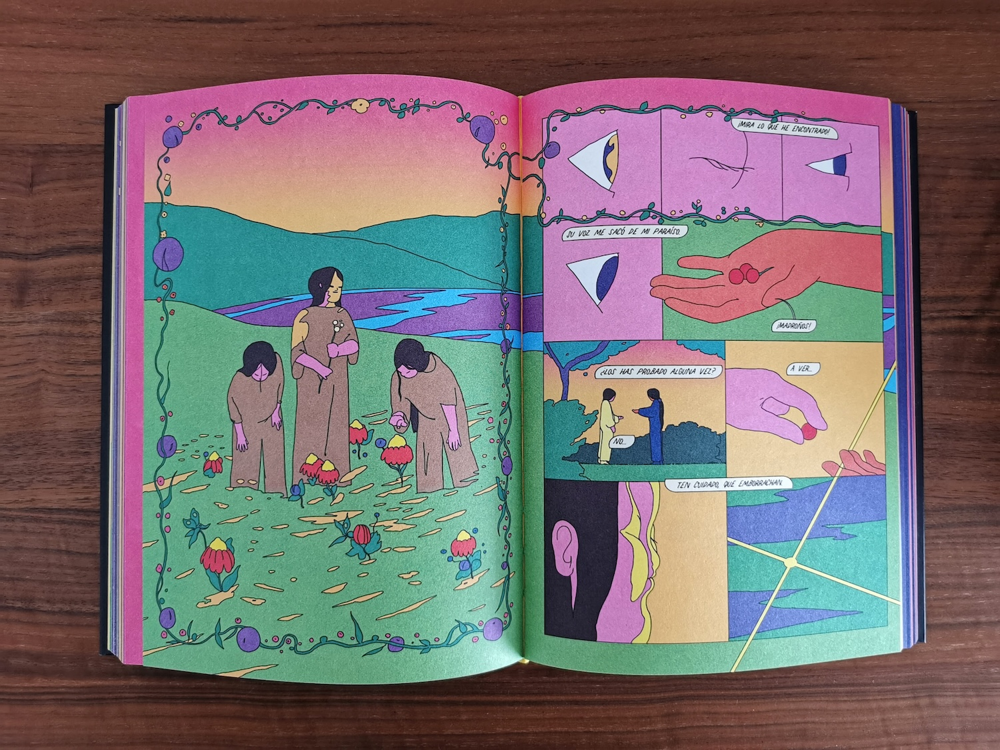
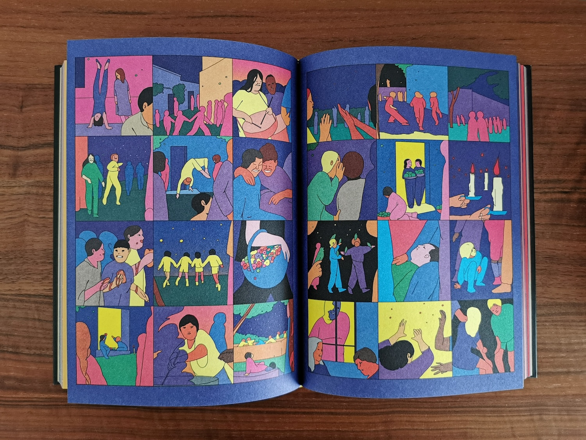
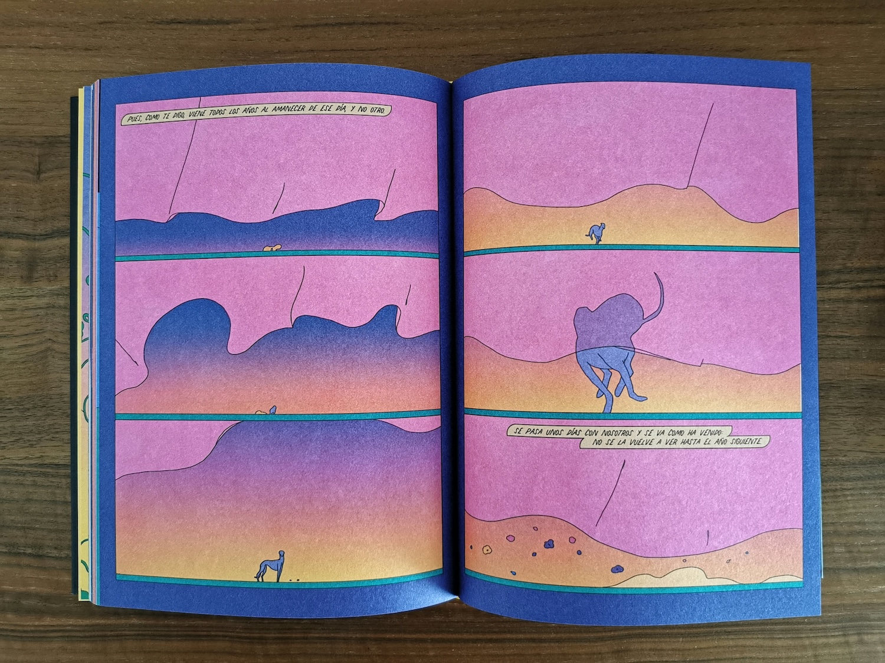
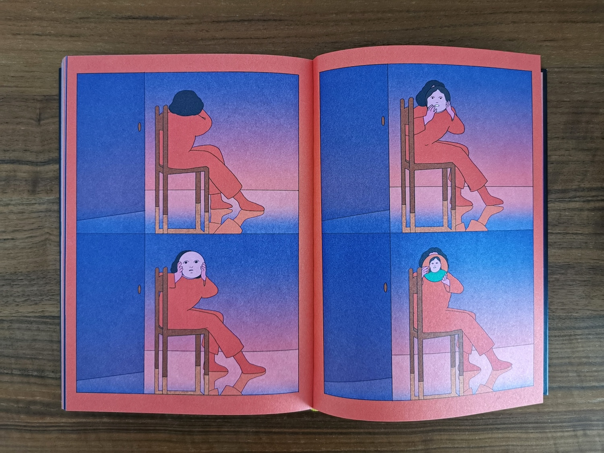
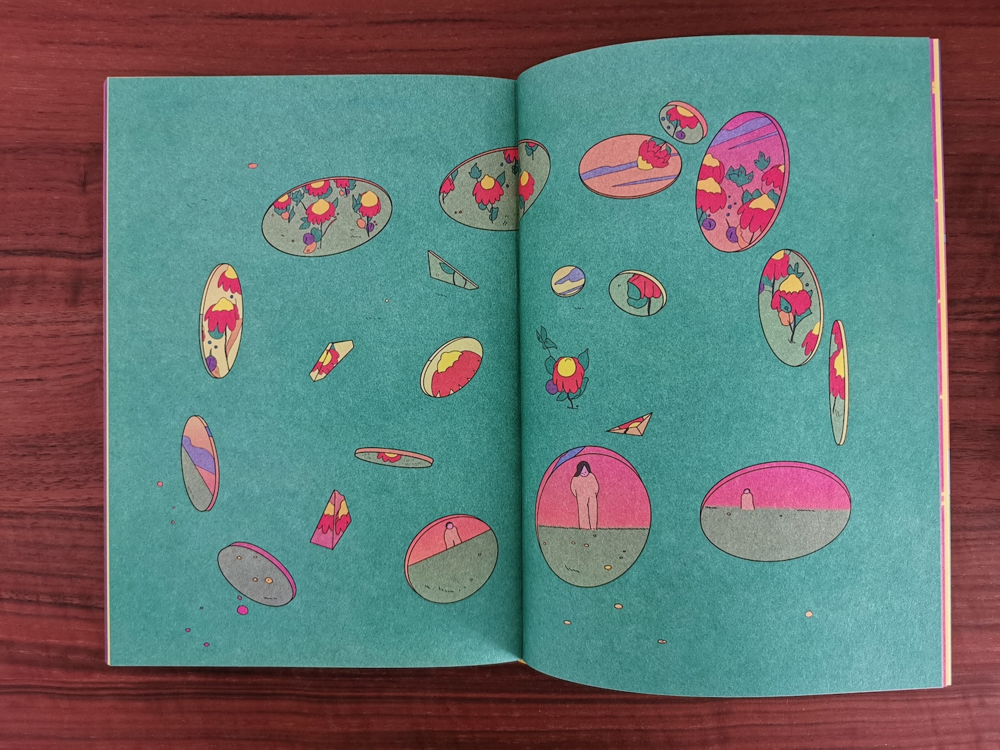
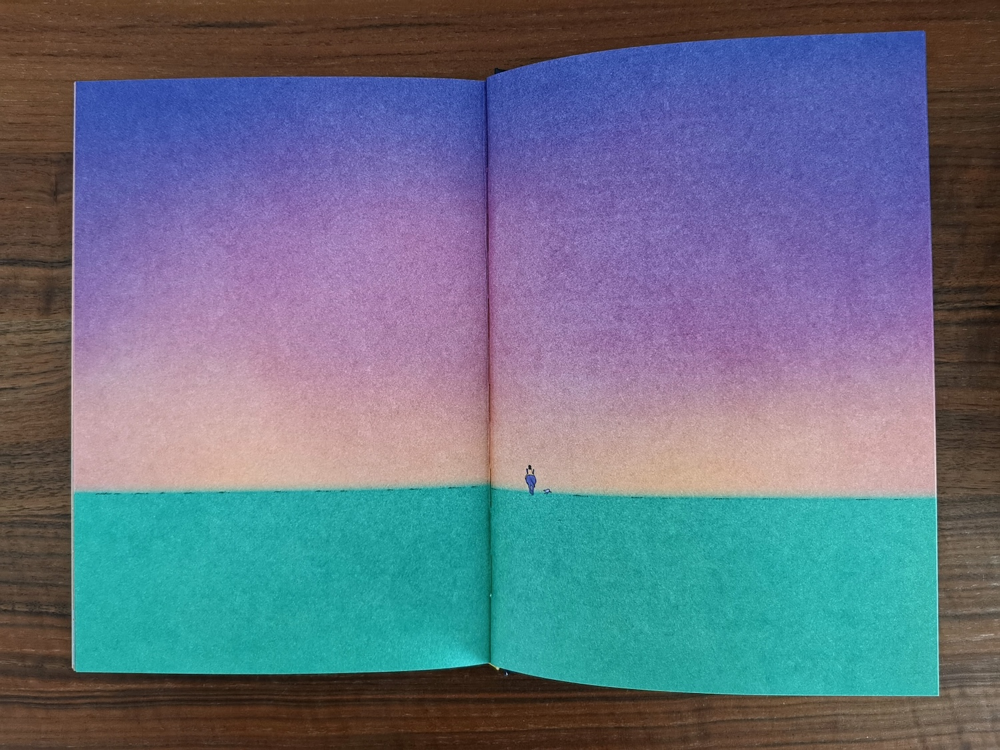

I really like this type of graphic novel created by María Medem. The focus on the visuals is immense and the use of colors is phenomenal and attractive to me.

I have to admit that I didn’t fully understand the story. I got some bits and was able to interconnect them. However, I may be wrong, but the focus was not to be more morally conclusive as much as it was to be visually and literally poetic. I got the sense that the idea was to soothe and make readers feel the contexts.

I interpreted in that way, so for me, it was a blast to turn the pages and be surprise by more and more poetry and suggestive imagery.

Now, this book is thick and has a lot to read and watch. That doesn’t help if the creator wanted us to come to any conclusion to the story. Every bit is so punchy that I forgot the story before.

I’m just glad that I read it and enjoyed it because, in the end, that is the goal with this type of book and I need to find more books like these until I wait for the next one by María.

