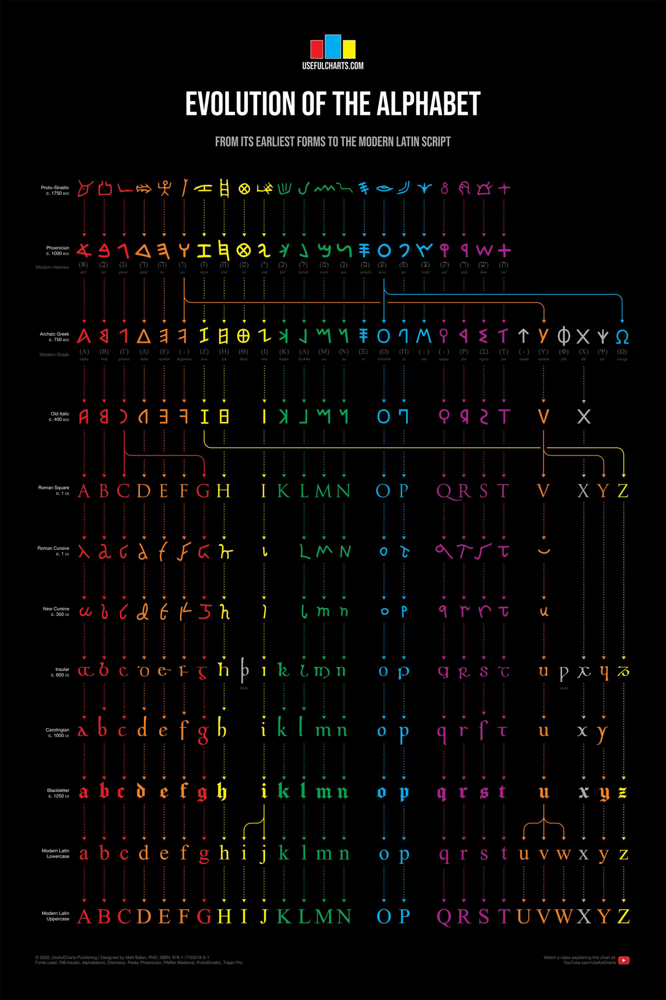

I want to create a new typeface where each character is inspired by the rawest form of its roots. The idea is to bring novelty in this space and a cryptographic aesthetic to, mainly, headings in typographic work.

This type of work will require some research to each letterform, so the holistic outlook is more engaging and radical.

The use of this previous research made by usefulcharts.com may be a good kick start:

