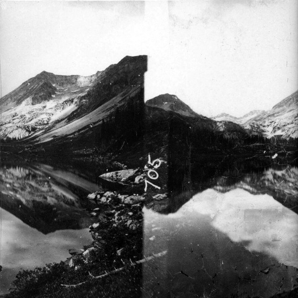

## Zauberberg

With Kassel Jaeger and Akira Rabelais.

It’s a surprising record that I like for the nuanced ambient work. I enjoy when a wave of some field recording fades in and out of the picture, evoking feelings from personal experiences with similar sounds.

In this sense, it’s very evocative to me and makes me travel. Good to listen to at home, potentially during winter, making me feel inspired to work on new creative projects.

