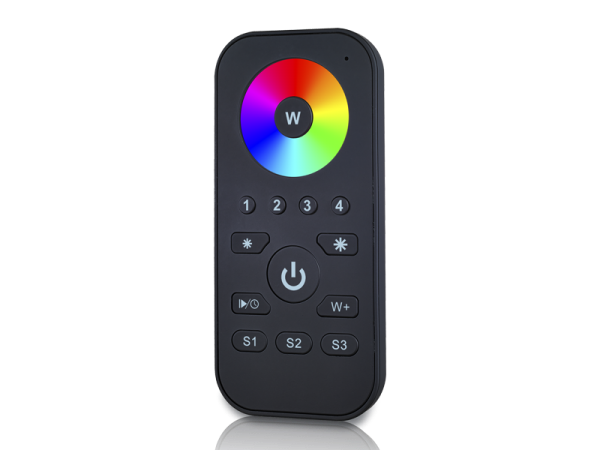

I’ve seen this brand recommended, but it’s difficult to find. Need to investigate more about it. I could potentially connect to all lights in my ecosystem using the Zigbee connection.

[Sunricher ZigBee Remote SR-ZG2819S-RGB](https://www.sunricher.com/4-groups-rgb-zigbee-remote-sr-zg2819s-rgb.html)

